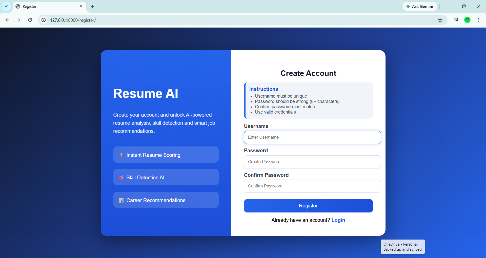
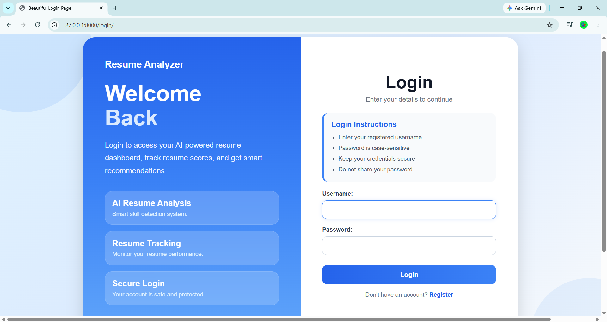
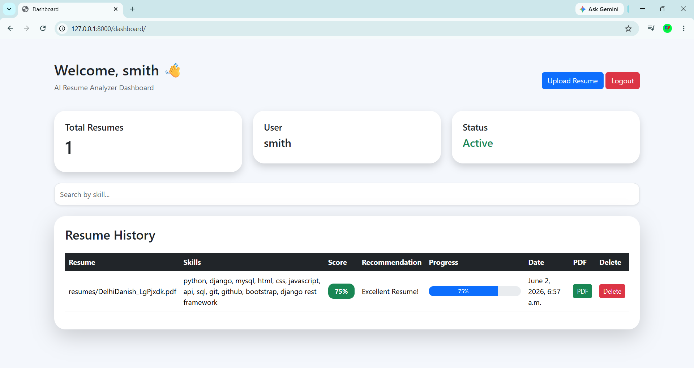
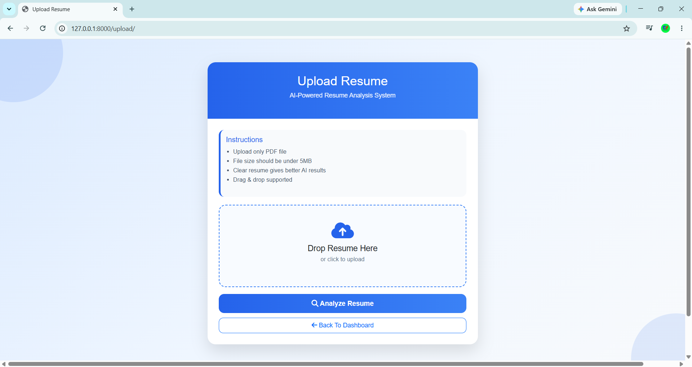

# 🚀 AI Job Recommendation System

An AI-powered Django web application that analyzes resumes and recommends suitable job roles based on candidate skills and experience.

---

## 📌 Features

✅ User Registration & Login

✅ Resume Upload

✅ Resume Parsing

✅ Skill Extraction

✅ Job Recommendation

✅ Dashboard

✅ Django REST API

✅ Admin Panel

---

## 🛠️ Tech Stack

- Python
- Django
- Django REST Framework (DRF)
- Object Oriented Programming (OOP)
- HTML
- CSS
- Bootstrap
- SQLite / MySQL
- Pandas
- NumPy
- Matplotlib
- Git
- GitHub

---

## 📂 Project Structure

```text
AI-Job-Recommendation-System/
│
├── resume_analyzer/
│   ├── resume_app/
│   ├── templates/
│   ├── migrations/
│   ├── static/
│   ├── media/
│   └── manage.py
│
├── .gitignore
├── README.md
└── requirements.txt
```

## ⚙️ Installation

### Clone Repository

```bash
git clone https://github.com/MdDanish9117/AI-Job-Recommendation-System.git
```

### Move into Project Folder

```bash
cd AI-Job-Recommendation-System
```

## 📸 Screenshots

### Register Page


### Login Page


### Dashboard


### Resume Upload



### Create Virtual Environment

```bash
python -m venv venv
```

### Activate Virtual Environment

Windows:

```bash
venv\Scripts\activate
```

Linux/Mac:

```bash
source venv/bin/activate
```

### Install Dependencies

```bash
pip install -r requirements.txt
```

### Run Migrations

```bash
python manage.py migrate
```

### Start Server

```bash
python manage.py runserver
```

---

## 🌟 Future Improvements

- AI Resume Score Prediction
- Skill Gap Analysis
- Resume PDF Generation
- Job Matching Accuracy Enhancement
- Email Notifications
- Admin Analytics Dashboard

---

## 👨‍💻 Author

**Md Danish**

GitHub:
https://github.com/MdDanish9117

---

## ⭐ Support

If you like this project, give it a ⭐ on GitHub.
