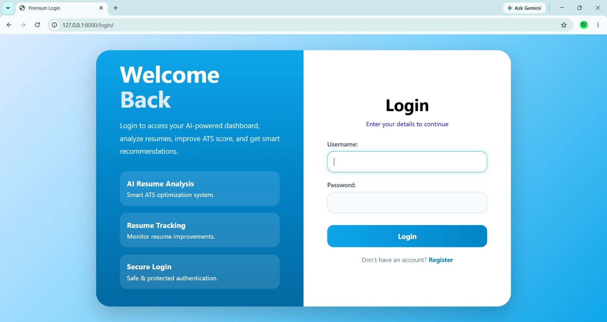
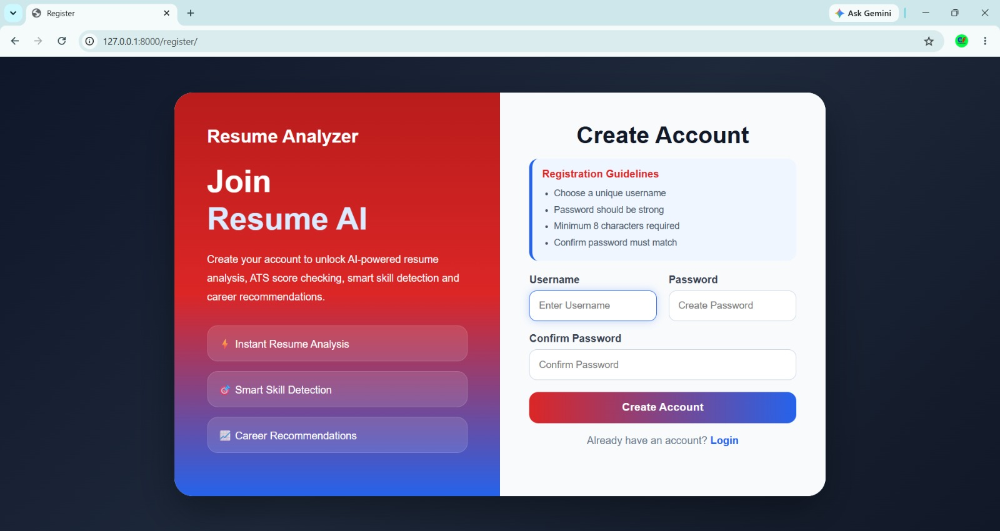
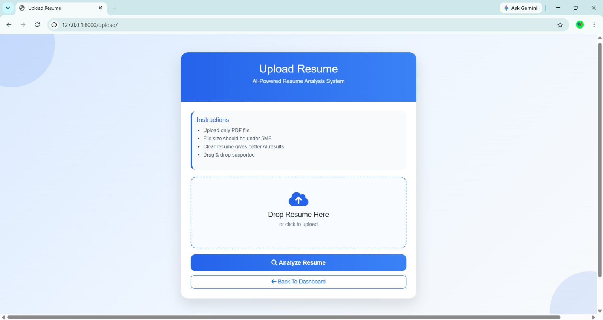
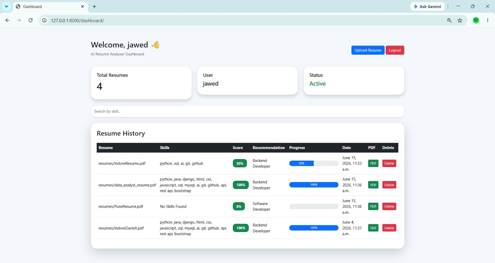
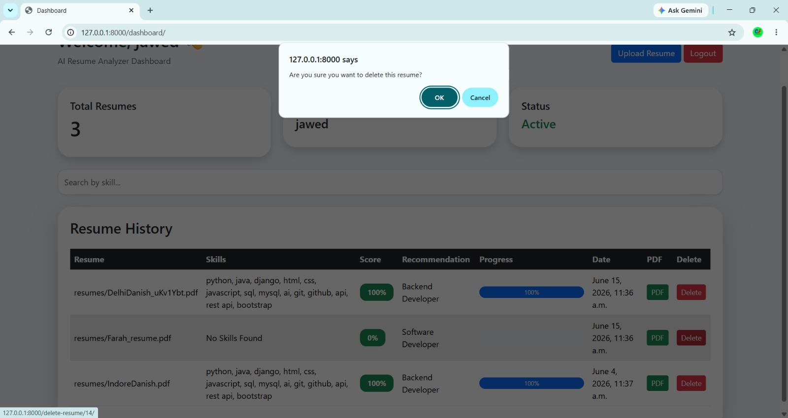

# 🚀 AI Job Recommendation System

An AI-powered Django web application that analyzes resumes and recommends suitable job roles based on candidate skills and experience.

---

## 📌 Project Overview

The **AI Job Recommendation System** helps users upload resumes, extract skills, and receive job recommendations based on their profile. It also provides REST APIs using Django REST Framework (DRF).

This project is designed to simplify recruitment and career guidance by using AI-based resume analysis.

---

## ✨ Features

✅ User Registration & Login Authentication

✅ Resume Upload System

✅ Resume Parsing

✅ Skill Extraction from Resume

✅ AI-Based Job Recommendation

✅ Search & Filter Jobs

✅ User Dashboard

✅ Resume Delete Feature

✅ Download Resume Report (PDF)

✅ Django REST API Integration

✅ CRUD Operations

---

## 🛠️ Tech Stack

### Frontend
- HTML
- CSS
- Bootstrap
- JavaScript

### Backend
- Python
- Django
- Django REST Framework (DRF)

### Database
- SQLite

### Other Tools
- Git & GitHub
- ReportLab (PDF Generation)

---

## 📂 Project Structure

```bash
AI-Job-Recommendation-System/
│── resume_analyzer/
│── screenshot/
│── README.md
│── .gitignore
│── manage.py
```

---

## ⚙️ Installation Guide

### 1️⃣ Clone Repository

```bash
git clone https://github.com/MdDanish9117/AI-Job-Recommendation-System.git
```

### 2️⃣ Move Into Project Folder

```bash
cd AI-Job-Recommendation-System
```

### 3️⃣ Create Virtual Environment

```bash
python -m venv env
```

### 4️⃣ Activate Environment

#### Windows

```bash
env\Scripts\activate
```

#### Mac/Linux

```bash
source env/bin/activate
```

### 5️⃣ Install Dependencies

```bash
pip install -r requirements.txt
```

### 6️⃣ Run Server

```bash
python manage.py runserver
```

---

## 🌐 API Endpoints

### Get All Jobs

```http
GET /api/jobs/
```

### Create Job

```http
POST /api/jobs/
```

### Update Job

```http
PUT /api/jobs/<id>/
```

### Delete Job

```http
DELETE /api/jobs/<id>/
```

---

## 📸 Project Screenshots

### 🔐 Login Page



---

### 📝 Register Page



---

### 📤 Resume Upload Page



---

### 📊 Dashboard



---

### 🔍 Search Filter


---

### 🗑️ Delete Resume



---

### 🔌 API List


---

### ❌ API Delete


---

## 🚀 Future Improvements

- AI Model Enhancement
- Better Job Matching Algorithm
- Resume Score Prediction
- Job Portal Integration
- Email Notification System

---

## 👨‍💻 Author

**Danish Ahmad**

📧 Email: your-email@example.com

🔗 GitHub: https://github.com/MdDanish9117

---

## 🤝 Contributing

Contributions are welcome!

Fork this repository and create a pull request.

---

## ⭐ Support

If you like this project, give it a **Star ⭐** on GitHub.

